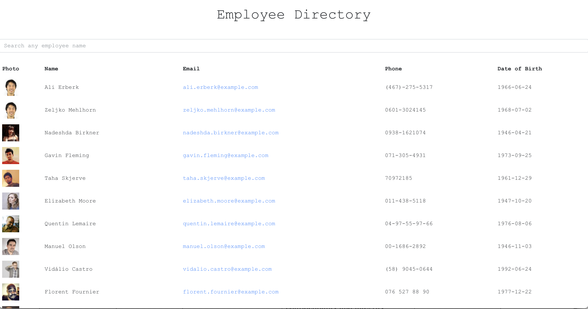

# Office-Directory

## Table of Contents

- [Description]

- [Deployed Site]

- [Installation]

- [Usage]

- [License]

## Description

This react application allows managers to be able to filter through non-sensitive

information to find employees contact information.

## Deployed Site

## Installation

NPM Install

## Usage

Run "npm start" in the terminal

## License

